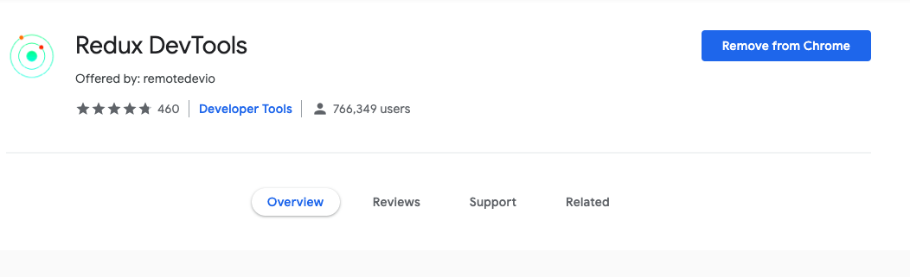

import { Head } from "mdx-deck";
export { future as theme } from "mdx-deck/themes";

<Head>
    <title>Knowledge Session (4) 🤯</title>
</Head>

# Knowledge Session (4) 🤯

---

## [Illustrations](https://illustrated.dev/)

---

## Web Components

-   [Introduction](https://www.dannymoerkerke.com/blog/web-components-will-replace-your-frontend-framework)
-   Applications
    -   [Material](https://dannymoerkerke.github.io/material-webcomponents)
    -   [UI5](https://sap.github.io/ui5-webcomponents/)

---

## Redux Dev Tool

---

## Setup

-   [Doc](http://extension.remotedev.io/#13-use-redux-devtools-extension-package-from-npm)
-   [Tetris Demo](https://chvin.github.io/react-tetris/?lan=en)

---

## GraphQL

---

## Webpack Loaders

---

## ES6 Challendge

-   Promise batching
-   Promise sequential
-   Mixings

---

## Until Next Time 👋

---
